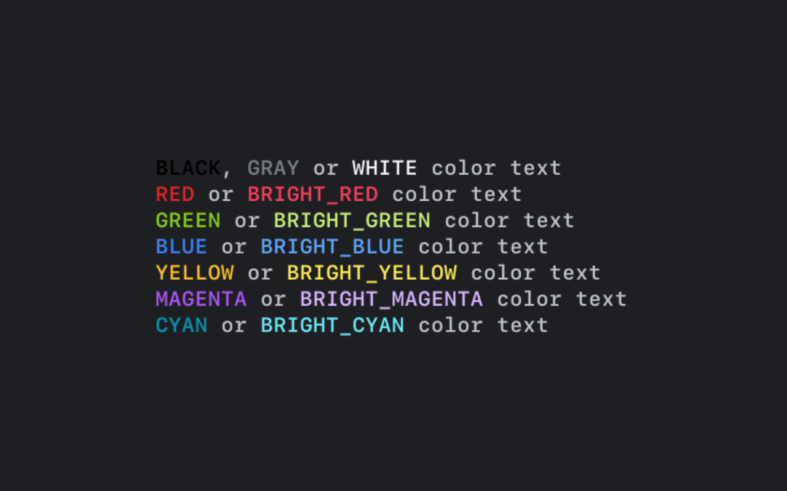

# colors.sh

Write colored text to the terminal easily.

<center>



</center>

## Installation

Download `colors.sh` and source it in your script or copy/paste the functions and variables into your script.

## Usage

```sh
source colors.sh

# with colors.sh sourced, you can use the constants
echo "${RED}This is red text${NC}"

# or you can use the functions
echo $(gray "[INFO] " && green "This is green test")
```

## Functions

- `gray` - for gray
- `light_gray` - for light gray
- `yellow` - for yellow
- `light_yellow` - for light yellow
- `green` - for green
- `light_green` - for light green
- `red` - for red
- `ligt_red` - for ligt red
- `blue` - for blue
- `light_blue` - for light blue
- `magenta` - for magenta
- `light_magenta` - for light magenta
- `cyan` - for cyan
- `white` - for white
- `black` - for black
- `bold` - for bold
- `underline` - for underline
- `blink` - for blink text
- `nc` - for no colors (reset)

## Contants

- `GRAY` - for gray
- `LIGHT_GRAY` - for light_gray
- `YELLOW` - for yellow
- `LIGHT_YELLOW` - for light yellow
- `GREEN` - for green
- `LIGHT_GREEN` - for light green
- `RED` - for red
- `LIGHT_RED` - for light red
- `BLUE` - for blue
- `LIGHT_BLUE` - for light blue
- `MAGENTA` - for magenta
- `LIGHT_MAGENTA` - for light magenta
- `CYAN` - for cyan
- `WHITE` - for white
- `BLACK` - for black
- `BOLD` - for bold
- `UNDERLINE` - for underline
- `BLINK` - for blink
- `NC` - for no colors (reset)